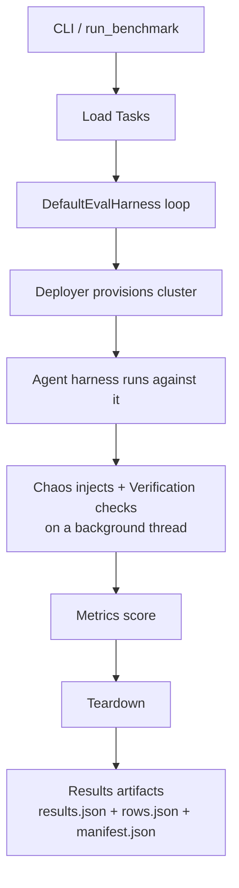

# Architecture

devops-bench is built as a set of pluggable components wired together by a single orchestration engine. Everything extensible is a registry, so adding a new agent, model, cloud, fault, verifier, or metric means registering a class — not editing the engine.

## The big picture

One engine, `DefaultEvalHarness`, runs each task through a fixed lifecycle. Chaos and verification run together on a background thread so the agent works against a cluster that is genuinely under stress while assertions watch it.

## The eval lifecycle

Each task moves through these steps in order. The responsible component is named in parentheses.

1. **Invocation** — `python -m devops_bench` parses arguments (`cli.py`) and calls `run_benchmark` (`run.py`).
2. **Per-run isolation (optional)** — under `--parallel`, a `RunEnv` gives the run its own kubeconfig, gcloud config, tofu data dir, and a run-unique cluster name (`core/run_env.py`).
3. **Load tasks** — task files are read from disk and validated into typed `Task` objects (`FileSystemTaskLoader`).
4. **Build the harness** — `DefaultEvalHarness` is constructed and snapshots one gated agent config so every run and every record reads the same capabilities.
5. **Deploy infrastructure** — the deployer is resolved and brought up (`get_deployer` → `up()`).
6. **Resolve specs** — `{{placeholders}}` are substituted and the chaos and verification specs are parsed into typed objects.
7. **Start the scenario** — chaos and verification begin on a daemon thread (`ScenarioManager`), and the harness waits briefly for the load to flow before the agent starts.
8. **Run the agent** — the agent under test executes against the live cluster (`AgentHarness.run`).
9. **Drain the scenario** — the background thread is joined and its chaos and performance reports are collected.
10. **Build the result record** — a symmetric result record is assembled so success and failed records share the same key set.
11. **Teardown** — infrastructure is torn down best-effort and never raises.
12. **Score** — the agent's output is graded by the metrics (LLM-as-judge plus deterministic checks). Scoring runs *after* the raw run record is already written to disk, so if scoring itself errors, you keep the completed run — it just ends up without scores.
13. **Persist artifacts** — `results.json`, `rows.json`, and `manifest.json` are written under the run directory.

## Extensibility model

Every axis is a registry. To extend the benchmark, add a class with the matching registration decorator, or ship an entry-point package that registers itself — no edit to the engine is needed.

| Axis | Registry |
| --- | --- |
| Agents | `AGENTS` |
| Models | `MODELS` |
| Cloud providers | `PROVIDERS` |
| Deployers | deployer factory |
| Chaos faults / triggers | `FAULTS`, `TRIGGERS` |
| Verifiers | `VERIFIERS` |
| Metrics | `METRICS` |

For step-by-step instructions, see the how-to guides:

- [Add a task](../how-to/add-a-task.md)
- [Add a model provider](../how-to/add-a-model-provider.md)
- [Add an agent harness](../how-to/add-an-agent-harness.md)

For deeper component reference, see the sibling docs in this directory, such as [glossary.md](./glossary.md) and [bastion.md](./bastion.md). The repository overview lives in the [root README](../../README.md).

## Resilience principles

- **One agent fault never aborts the batch.** A task that crashes becomes a `status: "failed"` record and the run continues.
- **Scoring and teardown failures do not sink a persisted run.** Raw execution results are written to disk before scoring, and teardown is best-effort.
- **Records share a symmetric key set.** Whether a task succeeds or fails, its result record has the *same* set of top-level fields — a failed run simply leaves the run-specific ones empty rather than omitting them. So anything reading `results.json` can treat every record the same way without first checking whether it succeeded.
