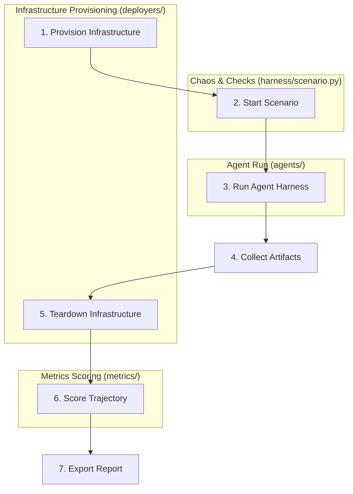

# Migration: Component design and principles

This document details the architectural decisions, design patterns, and engineering principles behind the restructured `devops-bench` library. 

### Documentation directory map
- For high-level steps for gke-labs maintainers, see [README.md](./README.md).
- For target directory layouts and glossary, see [directory-structure.md](./directory-structure.md).
- For the phased pull request deployment sequence, see [pr-plan.md](./pr-plan.md).
- For details on proving the plan using a local sandbox, see [VALIDATION.md](./VALIDATION.md).

---

## 1. Core principles

1. **Strict Library Mode**: The entire system is packaged under a single importable, installable namespace: `devops_bench`. No raw Python files are executed directly from directories outside the library path.
2. **One Unit = One Path = One PR, Tests Included**: Each module or component migrates with its corresponding unit tests (located under `tests/unit/`) in the same pull request. kubernetes-sigs requires PRs to be self-contained and fully tested on landing.
3. **Interfaces Before Implementations**: Define Abstract Base Classes (ABCs) or Protocols before creating concrete implementations. This decouples the execution engine from the subjects of evaluation and infrastructure dependencies.
4. **Extensibility via Registry**: Every major extension axis (Agents, Models, Deployers, Chaos Triggers, Chaos Faults, Verifiers, Metrics, Harnesses) is backed by a `Registry[T]` pattern, allowing new components to self-register.
5. **Transport-based Agent Isolation:** Benchmark subject agents (under evaluation) are organized strictly by their communication transport (`cli/`, `api/`, `chat/`). Support machinery loops (such as the Chaos Agent or LLM-as-judge metrics) are considered part of the harness orchestration and reside in their respective functional modules (`chaos/` or `metrics/`).
6. **Capability Negotiation**: The harness matches agents with tasks based on declared capabilities and explicit Python Protocols, rejecting unsupported schedules before provisioning infrastructure.
7. **Isolation of Shared Code**: Shared utilities must sink to a lower dependency layer. Sibling packages (e.g., `chaos/` and `verification/`) must never import each other.
8. **Dependency-Light Imports**: Eager imports of concrete implementations are banned in all package-level `__init__.py` files to prevent loading heavy third-party dependencies (like cloud SDKs) when they are not in use.

---

## 2. Agent architecture and capability negotiation

To prevent directory bloat and circular dependencies, we split agents across two distinct concerns: **Transport** (how the harness drives the agent) and **Capabilities** (what the agent supports).

### Transport folders
We place agents in subfolders under `devops_bench/agents/` based on their runtime transport mechanism:
- `cli/`: Subprocess-based CLI agents.
- `api/`: LLM-driven API agents, loop agents, and MCP clients.
- `chat/`: Multi-turn conversational agents.

### Capabilities specs and mixins
Capabilities represent cross-cutting features that any agent can implement. They reside in the `devops_bench/agents/capabilities/` subpackage. Each capability provides:
1. A `@runtime_checkable` `Protocol` defining the data attributes and methods the agent must support.
2. A companion `Mixin` that provides standard default implementations of those methods to avoid code duplication.

```python
# devops_bench/agents/capabilities/gitops.py
from typing import Protocol, runtime_checkable
from pathlib import Path

@runtime_checkable
class SupportsGitOps(Protocol):
    workspace_path: Path
    def open_pr(self, change: Change) -> PRRef: ...

class GitOpsMixin:
    """Default implementation of git/PR behavior that agents can inherit."""
    workspace_path: Path
    
    def open_pr(self, change: Change) -> PRRef:
        return git_open_pr(change, cwd=self.workspace_path)
```

> [!IMPORTANT]
> Any state a capability mixin reads from the agent MUST be declared as a data-attribute member on the `@runtime_checkable` Protocol (e.g., `workspace_path`). In Python ≥3.12, `isinstance` checks against runtime-checkable Protocols verify the presence of these data members, allowing the scheduler to safely validate agent readiness before running a task.

---

## 3. The evaluation harness (`harness/`)

The evaluation harness is the orchestration engine that drives the lifecycle of each benchmark task. It represents the decomposition of the legacy, monolithic `evaluate.py:main()` script into clean, reusable phases.

### Harness run pipeline

The default engine (`harness/default.py`) executes the following sequence for each task:



### Run pipeline steps
1. **Provision**: Invokes the configured `Deployer` to spin up a local Kind cluster or a GKE environment. It builds a `RunContext` carrying the connection parameters and task metadata.
2. **Scenario Start**: Handed to the `ScenarioManager` (`harness/scenario.py`). It boots the background thread orchestration for chaos injection and concurrent verification.
3. **Run Agent**: Fires up the selected `AgentHarness`, running its main loop against the target environment.
4. **Collect**: Diffs the local workspace and scrapes cluster states, gathering the agent trajectory, tool invocations, tokens used, and generated outputs.
5. **Teardown**: Destroys the provisioned infrastructure to free cloud and local resources (retained if `BENCH_NO_TEARDOWN=1`).
6. **Score**: Runs the metrics judge pipeline (`metrics/`) to evaluate outcome validity, grounding, and safety/chaos resilience.
7. **Report**: Appends results to a central JSON feed for reporting.

---

## 4. Chaos and verification extensibility

The chaos and verification subpackages live behind clean interfaces to ensure that new chaos faults, triggers, and outcome verifiers can be added without altering the core orchestrator.

### Chaos model
Chaos consists of a **Trigger** (when to inject) and a **Fault** (what to inject), corresponding to `spec.trigger` and `spec.action`.

```python
# devops_bench/chaos/base.py
class Trigger(ABC):
    @abstractmethod
    def wait(self, ctx: RunContext) -> None: ...  # Blocks until firing condition is met

class Fault(ABC):
    @abstractmethod
    def inject(self, ctx: RunContext) -> ChaosResult: ...
```

- Triggers (`chaos/triggers/`) are self-contained classes (e.g., `delay.py`, `periodic.py`, or `k8s_event.py`).
- Faults (`chaos/faults/`) are specific actions (e.g., `pod_kill.py`, `node_drain.py`, `cpu_load.py`).
- To add a new fault or trigger, simply create a file in its respective directory and register it using `@TRIGGERS.register` or `@FAULTS.register`.

### Verification model
Verification represents check criteria run either at the end of a scenario or continuously in the background during execution.

```python
# devops_bench/verification/base.py
class Verifier(ABC):
    @abstractmethod
    def verify(self, ctx: RunContext, timeout_sec: int) -> VerificationResult: ...
```

- Verifiers live under `devops_bench/verification/verifiers/` (e.g., `pod_healthy.py`, `service_responsive.py`).
- You can compose verifiers hierarchically using lists or dictionaries in the task specification. The runtime automatically parses these into a verifier tree.

---

## 5. Dependency layering and import graph

To prevent circular import dependencies, the repository relies on a strict **layered architecture**. A module at any given layer may only import from its own layer or from layers below it. **Sibling directories at the same layer must never import each other.**

```text
+--------------------------------------------------------+
|                      5. Entrypoint                     |
|                      (devops_bench/cli.py)             |
+--------------------------------------------------------+
                           |
                           v
+--------------------------------------------------------+
|                      4. Engine                         |
|                     (devops_bench/harness/)            |
+--------------------------------------------------------+
                           |
                           v
+--------------------------------------------------------+
|                      3. Components                     |
|    (tasks/, deployers/, agents/, chaos/,               |
|     verification/, metrics/)                           |
+--------------------------------------------------------+
                           |
                           v
+--------------------------------------------------------+
|                      2. Shared Providers               |
|           (devops_bench/k8s/, devops_bench/models/)    |
+--------------------------------------------------------+
                           |
                           v
+--------------------------------------------------------+
|                      1. Foundation                     |
|                     (devops_bench/core/)               |
+--------------------------------------------------------+
```

### Avoiding cycles with `RunContext`
`RunContext` must be accessible to almost every component (including lower layers like `chaos` or `verification`), yet it references high-level structures like `Task`, `Deployer`, or `EventStream`. To prevent circular imports, we enforce two design rules:
1. We define the `RunContext` type in the foundation layer (`devops_bench/core/context.py`) and build the instance in the top layer (`harness/base.py`).
2. We type high-level fields in `RunContext` using **Protocols** or `TYPE_CHECKING` guards to prevent the `core` layer from importing upward.

---

## 6. Lazy registry population and heavy backends

To maintain high performance and low startup times, `devops-bench` prevents eager package loads on startup.

### Entry-point plugin discovery
Instead of using `__init__.py` files that eagerly import all implementation files, registries leverage Python's `importlib.metadata` entry points. We register concrete implementations in `pyproject.toml` and load them on demand:

```toml
# pyproject.toml
[project.entry-points."devops_bench.agents"]
gemini = "devops_bench.agents.cli.gemini:GeminiCli"
openclaw = "devops_bench.agents.cli.openclaw:OpenClawCli"
```

The registry resolving logic loads and caches the imported module on the first call to `REGISTRY.get("gemini")`.

### Heavy extras
To keep the base install light, we declare heavy third-party libraries (such as cloud SDKs or proprietary model clients) as optional dependencies (extras):

```toml
# pyproject.toml
[project.optional-dependencies]
anthropic = ["anthropic>=0.104.1"]
gcp = ["google-cloud-storage", "google-cloud-aiplatform"]
```

Users installing only the core framework (`pip install devops-bench`) will not pull down heavy cloud SDKs. If a selected component requires an extra that is missing, the framework raises a clear, helpful error on startup (e.g., `"Please install devops-bench[gcp] to use the GCP deployer"`).

---

## 7. Skills directory architecture

Evaluation skills are markdown checklists and guidelines (such as `skills/outcome-validity-checklist.md` and `skills/tool-invocation-skill.md`) used at runtime by:
1. LLM-as-judge metrics to evaluate the trajectory.
2. BYO-skill agents to understand instructions.

Because skills are content data and change independently of library logic, they reside in a top-level `skills/` directory at the repository root. Sibling modules inside the `devops_bench` library read these files directly from disk. The `devops_bench/agents/capabilities/skills.py` package handles loading and mapping these file paths to active agent workspaces.
