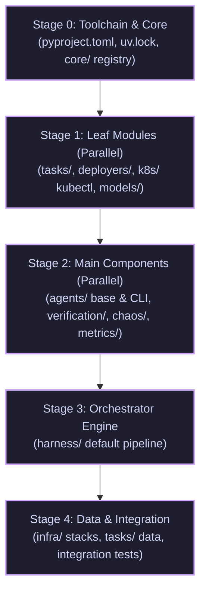

# Migration: PR execution plan

### Documentation directory map
- For high-level steps for gke-labs maintainers, see [README.md](./README.md).
- For a deep dive into component design and principles, see [component-design.md](./component-design.md).
- For target directory layouts and glossary, see [directory-structure.md](./directory-structure.md).
- For details on proving the plan using a local sandbox, see [VALIDATION.md](./VALIDATION.md).

This document maps out the phased execution strategy to migrate `devops-bench` from `gke-labs/devops-bench` (the *incubator*) to `kubernetes-sigs/devops-bench` (the *canonical* home) as small, reviewable Pull Requests.

---

## 1. Core PR execution principles

To ensure a smooth, error-free upstream review process, every PR must adhere to these structural constraints:

1. **Co-locate Implementation and Unit Tests**: As outlined in the [architectural principles](./component-design.md#1-core-principles), each module or package must migrate together with its corresponding unit tests under `tests/unit/` in a single PR. 
2. **Prioritize Interfaces and Registries**: Basic classes, registries, and Abstract Base Classes (ABCs) must land before the concrete implementations that import them to ensure clean dependency trees.
3. **Keep the Frontier Documented**: Immediately after an upstream PR merges, uncomment its paths in `migrated.bara.sky` in a small, reviewed `gke-labs` PR (refer to [README.md](./README.md) §4 Step 2.2 for details). This locks the paths and activates the back-sync bot.
4. **All PRs are Disposable**: If a forward PR becomes stale, close it and re-assemble a clean one using `prep-export.sh`.
5. **No Cross-Border Imports**: Banish imports of un-migrated paths in migrated code to maintain a clean boundary.

---

## 2. Phased PR sequence

The migration is divided into 5 chronological stages. Stage 0 is the prerequisite for all subsequent steps. Within Stages 1 and 2, modules can migrate largely in parallel.

---

### Stage 0: Toolchain and foundation
This is the unblocker. No code can migrate until the toolchain and CI checks are established upstream.

- **0a. Toolchain & CI Setup**:
  - **Files**: `pyproject.toml`, `uv.lock`, `.python-version`, `devops_bench/__init__.py`, `.github/workflows/guardrails.yml`, `hack/boilerplate.py`.
  - **Details**: Defines Hatchling as the build system, lists base dependencies, and configures lints (`ruff`). It also installs the GitHub Actions guardrail to check Python code, verify lints, and enforce boilerplate headers.
- **0b. Foundation (`core/`)**:
  - **Files**: `devops_bench/core/*` (registry, context, results, logging, subprocess, errors, config), `tests/unit/core/*`.
  - **Details**: Moves domain-agnostic helpers and types (such as `RunContext` type) so they are available to all higher layers.

---

### Stage 1: Leaf modules
Leaf modules have zero internal dependencies other than `core/` and basic standard library packages.

- **1a. Task contracts (`tasks/`)**:
  - **Paths**: `devops_bench/tasks/` (schema, loader, registry), `tests/unit/tasks/`.
  - **Details**: Formalizes task specifications and parsing logic.
- **1b. Infrastructure deployers (`deployers/`)**:
  - **Paths**: `devops_bench/deployers/` (base, factory, tofu, gcp, kind), `tests/unit/deployers/`.
  - **Details**: Abstract base classes and concrete engines for provisioning Kind or GKE clusters.
- **1c. Kubernetes wrappers (`k8s/`)**:
  - **Paths**: `devops_bench/k8s/kubectl.py`, `devops_bench/k8s/conditions.py`, `tests/unit/k8s/`.
  - **Details**: Basic kubectl utilities and wait/poll configurations. (Note: event watches are deferred).
- **1d. LLM clients (`models/`)**:
  - **Paths**: `devops_bench/models/` (base, google, anthropic), `tests/unit/models/`.
  - **Details**: Provider-agnostic model access layers.

> [!TIP]
> Send the smallest leaf first (e.g., `tasks/`) to verify your whole toolchain, fork PR mechanics, CNCF EasyCLA, and the first `migrated.bara.sky` flip + back-sync run with minimal risk.

---

### Stage 2: Main components
These components depend on Stage 1 leaves and form the primary building blocks of benchmark execution.

- **2a. Agents base and CLI (`agents/`)**:
  - **Paths**: `devops_bench/agents/base.py`, `devops_bench/agents/cli/`, `tests/unit/agents/`.
  - **Details**: Introduces the `AgentHarness` base class and the CLI agents (`gemini`, `openclaw`). We defer capabilities to keep the initial export small.
- **2b. Verification engine (`verification/`)**:
  - **Paths**: `devops_bench/verification/` (base, spec, runner, verifiers/), `tests/unit/verification/`.
  - **Details**: Implements outcome assertions and the condition verification tree. Depends on `k8s/`.
- **2c. Chaos injector (`chaos/`)**:
  - **Paths**: `devops_bench/chaos/` (base, agent, faults/generate_load), `tests/unit/chaos/`.
  - **Details**: Implements the core chaos scheduler and the network load injection fault. Depends on `models/`.
- **2d. Metrics judge (`metrics/`)**:
  - **Paths**: `devops_bench/metrics/`, `tests/unit/metrics/`, and associated `skills/` Markdown guides (e.g., `skills/outcome-validity-checklist.md`).
  - **Details**: Implements LLM-as-judge scoring pipelines and prompt criteria. You must migrate Markdown guides in the same PR as the metric code that reads them to prevent runtime path resolution failures.
- **2e. API loop agents (`agents/api/`)**:
  - **Paths**: `devops_bench/agents/api/` (loop, mcp), `tests/unit/agents/api/`.
  - **Details**: Advanced agentic integration loops.

---

### Stage 3: Orchestrator engine
With all leaves and components in place, the core run loop can now migrate.

- **3a. Run orchestration (`harness/`)**:
  - **Paths**: `devops_bench/harness/` (base, default, scenario, artifacts), `tests/unit/harness/`.
  - **Details**: Integrates the `ScenarioManager` (controlling chaos and verification) with the `DefaultHarness` (managing task loops, provisioning, execution, and teardown).

---

### Stage 4: Data and entrypoints
This final stage completes the transition, activating full end-to-end capabilities upstream.

- **4a. Terraform infrastructure stacks (`infra/`)**:
  - **Paths**: `infra/modules/`, `infra/stacks/`.
  - **Details**: Reorganizes Terraform modules and the baseline local common stack.
- **4b. Benchmark tasks (`tasks/` data)**:
  - **Paths**: `tasks/` definitions (the task YAML files and their co-located task infra directories).
  - **Details**: Moves all evaluations and benchmark scripts out of the library space.
- **4c. Command-line interface and integration tests**:
  - **Paths**: `devops_bench/reporting/`, `devops_bench/cli.py`, `tests/integration/`.
  - **Details**: Delivers high-level reporting utilities, the CLI entrypoint, and cross-cutting integration tests spanning multiple components.

---

## 3. Post-migration: Developing net-new features

Restructuring only covers existing features. Once the foundational migration is complete, advanced functionality is built directly in the upstream repo:

- `agents/capabilities/` (`Capabilities` spec, `Supports*` protocols, `*Mixin` classes).
- `k8s/events.py` (The stateful live `kubectl get --watch` stream) and `chaos/triggers/event.py`.
- Additional chaos faults (`pod_kill.py`, `node_drain.py`) and next-gen agents or judges.
